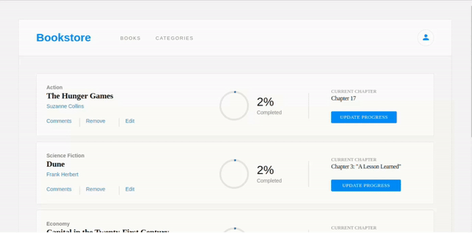
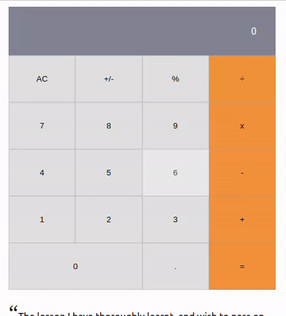

### *Last implementation* 👋 : **Amazing Bookstore !**
 
 [](https://jojo987n.github.io/Bookstore/)
<table >
    <tr>
        <td   >
         <p><b>A little more about me...</b></p>
<pre>

```javascript
class Me {
    constructor() {
     this.pronouns = ["he", "his"];
      this.skills = {
       language: ["JavaScript", "HTML", "CSS"],
       frameworks: ["React", "Redux", "React Native"]
     }
     this.projects = {
       microverse: ["Portfolio", "Book list", "To do List"],
       "before microverse": ["uber eats clone app"],
       }
     this.background = `I studied mathematics and 
     computer science` }
    lookingFor = () => ({
       "Remote Job": 
       "Front-end developer" || "Back-end developer",
        })
   }
```
</pre>
        </td>
        <td style="">
<p style="">
 
*Nice implementation* : **Powerful calculator !**
 
</p>
            <p>
             <a href="https://jojo987n.github.io/math-magicians/" target="_blank"></a>
            </p>
        </td>
    </tr>
</table>


<!--
**jojo987N/jojo987N** is a ✨ _special_ ✨ repository because its `README.md` (this file) appears on your GitHub profile.

Here are some ideas to get you started:

- 🔭 I’m currently working on ...
- 🌱 I’m currently learning ...
- 👯 I’m looking to collaborate on ...
- 🤔 I’m looking for help with ...
- 💬 Ask me about ...
- 📫 How to reach me: ...
- 😄 Pronouns: ...
- ⚡ Fun fact: ...
-->
