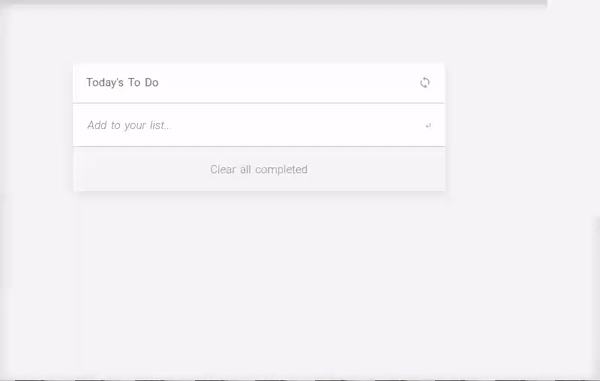

### Hi there 👋 I'm Narcisse Jemba! 
 
<table >
    <tr>
        <td  colspan="2" style="border: 1px solid black;">
         <b>A little more about me...</b><br/>
<pre>

```javascript
class me {
constructor() {
this.pronouns = ["he", "his"];
this.skills = {
    language: ["JavaScript", "HTML", "CSS"],
    frameworks: ["React", "Redux", "React Native"]
}
this.projects = {
    microverse: ["Portfolio", "Book list", "To do List"],
    "before microverse": ["uber eats clone app"],
}
this.background = `I studied mathematics and 
computer science`
} lookingFor = () => ({
    "Remote Job": 
    "Front-end developer" || "Back-end developer",
})
}
```
</pre>
        </td>
        <td style="">
<p style="">
 
*Last implementation* : **To Do List drag and drop**
 
</p>
            <p>
             <a href="https://jojo987n.github.io/to-do-list/dist/" target="_blank"></a>
            </p>
        </td>
    </tr>
</table>


<!--
**jojo987N/jojo987N** is a ✨ _special_ ✨ repository because its `README.md` (this file) appears on your GitHub profile.

Here are some ideas to get you started:

- 🔭 I’m currently working on ...
- 🌱 I’m currently learning ...
- 👯 I’m looking to collaborate on ...
- 🤔 I’m looking for help with ...
- 💬 Ask me about ...
- 📫 How to reach me: ...
- 😄 Pronouns: ...
- ⚡ Fun fact: ...
-->
